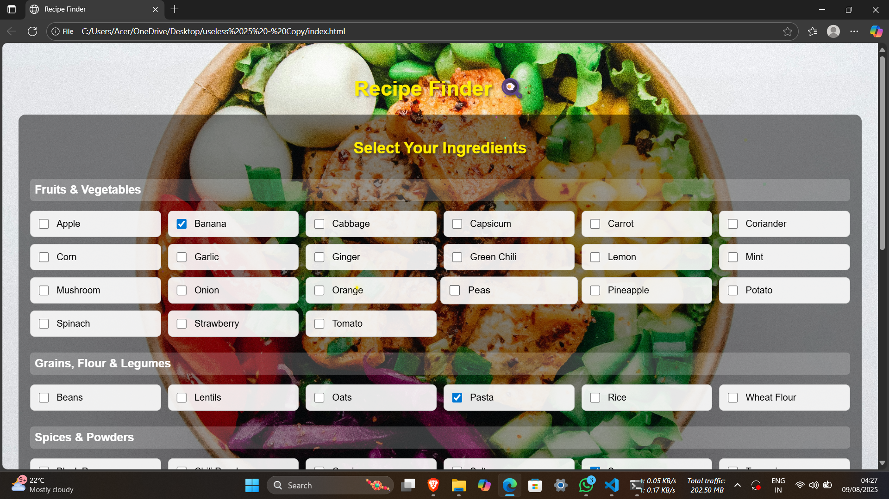

# Recipe Finder 🍳

## Basic Details
### Team Name: HAZE

### Team Members
- Team Lead: AMAL DEV T S - GOVERNMENT ENGINEERING COLLEGE, IDUKKI
- Member 2: AMAL P ANIL - GOVERNMENT ENGINEERING COLLEGE, IDUKKI

### Project Description
Recipe Finder is a web application that helps you discover what meals you can cook based on the ingredients you already have at home. No more staring blankly into your fridge! Just select what you've got, and we'll show you all possible recipes you can make right now.

### The Problem (that doesn't exist)
Have you ever found yourself with a random assortment of ingredients but no idea what to cook? Or worse - convinced you have "nothing to eat" when your fridge is actually full? Our solution eliminates this first-world problem by magically transforming your random ingredients into actual meal options.

### The Solution (that nobody asked for)
Recipe Finder takes your scattered ingredients and matches them against our database of delicious recipes. We'll show you exactly what you can make, complete with step-by-step instructions. It's like having a personal chef who works exclusively with whatever weird combination of items you happen to have!

## Technical Details
### Technologies/Components Used
For Software:
- HTML5, CSS3, JavaScript
- No frameworks - pure vanilla JS for maximum uselessness
- CSS animations for delightful (but unnecessary) visual effects
- GitHub for version control

For Hardware:
- Any device with a web browser
- An internet connection (optional - can run locally)
- A kitchen (for actually making the recipes)

### Implementation
For Software:
# Installation
No installation needed! Just open the HTML file in any modern browser.

# Run
1. Download the project files
2. Open `index.html` in your favorite browser
3. Start selecting ingredients!

### Project Documentation
For Software:

# Screenshots (Add at least 3)

*Add caption explaining what this shows*

*Add caption explaining what this shows*

*Add caption explaining what this shows*

# Diagrams

*Add caption explaining your workflow*

For Hardware:

# Schematic & Circuit

*Add caption explaining connections*

*Add caption explaining the schematic*

# Build Photos

*List out all components shown*

*Explain the build steps*

*Explain the final build*

### Project Demo
# Video
[Add your demo video link here]
*Explain what the video demonstrates*

# Additional Demos
[Add any extra demo materials/links]

## Team Contributions
- AMAL DEV T S: Project architecture, JavaScript logic, recipe database
- AMAL P ANIL: UI design, CSS animations, documentation
---
Made with ❤️ at TinkerHub Useless Projects 

